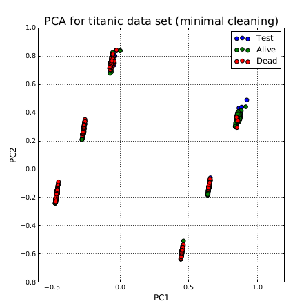
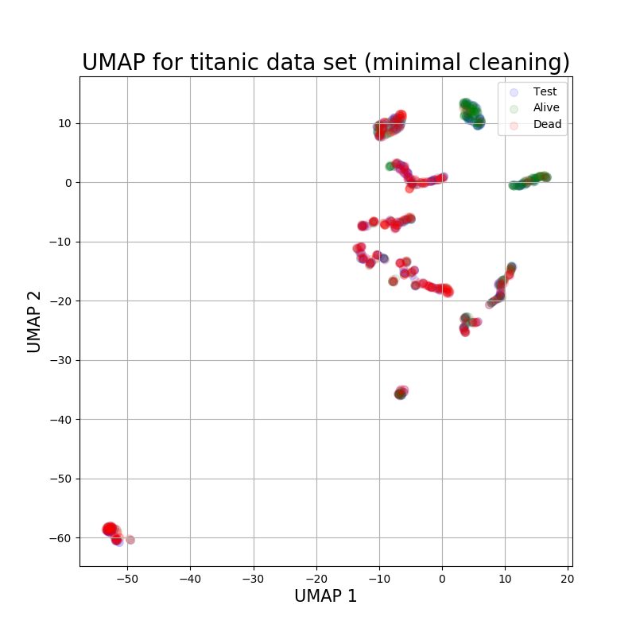
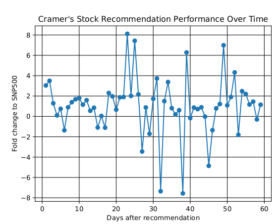
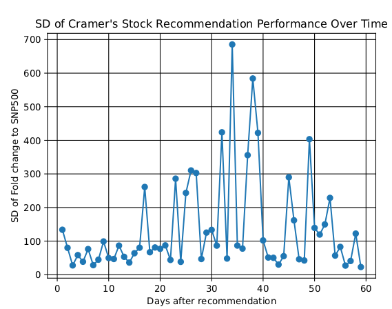

# Projects

## ML in python

This project is really implementations of various machine learning algorithms from scratch in python. A training and test data set consistent of ticketing information for passengers on the Titanic was obtained from Kaggle to use in the project. The goal is to predict whether a passenger lived or died based on that ticketing information. 

### PCA

Principle component analysis was carried out primarily to visualize the data in conjunction with the KNN algorithm. It's interesting that the principle components lead to major 6 very clear clusters but it makes sense considering that major sources of variation in the data set are binary or binary like values (sex : male/female, class : 1/2/3). Based on this, it seems like KNN is not going to generate very good predicitions.

### KNN

K nearest neighbor was used to predict survival. Missing data was replace with the mean of the column and columns were normalized between 0:1. For each test point, the three nearest neightbors were calculated using euclidian distance. The prediction was simply the biggest vote of the three nearest neighbors. As we predicted earlier based on looking at the PCA, the KNN finishes pretty badly with a 71% classification success rate.

### Decision Tree

Next up is the decision tree. The algorithm recursively splits the data based on the feature and feature threshold that maximizes 'information gain' for any given node in the tree. If the information gain isn't above a given threshold (in this case 0.05) then the node becomes a leaf and the prediction of the leaf is a vote of the training data grouped at the leaf. The function does a bit better than KNN, coming in with 78% classification success rate. With some tweaking it could probably get up to the mid 80% range, but that's not the focus of this project.

### UMAP

While UMAP isn't directly direct clustering algorithm, it has proven to be a very powerfuly dimension reduction technique within our scRNAseq work. I've implemented UMAP using the python module 'umap-learn'. We will use KNN on the data points 2d embeddings to generate our classifications. 

After classification we get a score of 75.6%. UMAP didn't improve KNN performance at all. Nonetheless, it provides a better visualization than PCA.

### Perceptron

Writing a perceptron from scratch is a great way to get into the nitty gritty mathematics of neural networks - matrix calculus and all. The perceptron I've implemented is a single layer neural network which allows for variation of any number of nodes in the hidden layer as well as any size of data input, however it only generates a binary classifier output with a single node in the output layer. Training seems to show 

## Mad Money Maybes

The project started with the idea to compare stock picks from experts (i.e. Mad Money Cramer) with an SNP500 index ETF or something similar. I thought it might be possible to try to ride a price surge from a stock's appearance on the show and determine a best mean flat time to sell after. People have looked at Mad Money stock picks in the past plenty and have determined that his predictions don't outperform the market's average, but I haven't seen anyone trying to specifically examine if/how much of a temporary surge in price there is from Mad Money 'fame'. The basic outline for the project is as follows:

#### 1. Get Cramer's historic market picks. Target date: 9/1/18

Plan (8/10/18):

There is an excellent repository of Cramer's stock recommendations (CSRs) all the way through 2006 on seekingalpha. My first attempt will be to scrape the website and get a complete list of all of his bull and bear recommendations. If I can't figure that out, I will simply construct a data set by hand selecting all recommendations within a given time length (i.e. 1 week or so) evenly spaced from the beginning to the end of his recommendations.

Results (8/23/18, written 9/19/18):

After trying many scraping options, I did finally figure out how to successfuly scrape seekingalpha. I ended up having to try various techniques (including Spyder, BeautifulSoup4, and Selenium all with various lists of proxy IPs but none of the above worked. Finally, I learned that I could do local redirection with TOR and point firefox at the local redirection. This ended up working but will require configuration on your end to work with the script. I leave that up to you. All in all, I was able to get a complete list of all ticker symbols from Cramer's 'Lightning Round' picks that are available on seekingalpha (which appears to be from June, 2005 onwards).

#### 2. Plot mean changes in stock price as a function of time since his recommendation. Target date: 10/1/18

Plan (8/10/18):

Once we have a list of CSRs by date, we need to see how they compare to the market as a function of time after recommendation. In specific, I want to plot CSRs returns day by day after recommendation. It has been shown that there is a small surge in price the day after Cramer recommends a stack (~1%) but no one seems to have looked at how it tracks over time. As the goal is to see if we can beat an SNP500 index fund, the returns will be normalized against one. Finally, we can pick an optimal sell time to harvest the temporary surge in prices (if one exists).

It would also be interesting to see if/how CSR returns vary as a function of date. It may be the case that CSR had a large impact on the market when his show was newer and less people relied on the internet for information and the effect has tapered off to date. Average returns by date of recommendation can be plotted to see if that's the case.

Results(9/2/18, written 9/19/18):

As a quick note, this section will likely continually be updated as I think of new ways that I want to look at the data. As a preliminary look, I did exactly what I described in the plan section. For each stock recommendation that is a.) in my market data set and b.) has at least 60 days of performance data from the recommendation date, I directly compared performance to the SNP500. I then plotted the mean return for CSR normalized against SNP500 performance within the same period as the recommendation (below).

At first glance it seems that there might be a small trend above the SNP500 in the short term for CSRs. However, the standard deviations are huge:

Even at the low end, the deviation of the picks is ~25 fold changes. Also worth noting, the randomness in the data seems to increase significantly after the ~20 day mark. These seems to support the idea that CSRs are not good long term investment picks. While I don't think it's a good investment strategy, if forced to pick I would pick a date in the first ~20 days with low(er) standard deviation. 10 days after the initial recommendation seems to fit the bill. 

#### 3. See if we can beat Cramer. Target date TBD

At this point, we should have a strong idea for whether we can manipulate public surge in opinion based on public stock exposure. Either way, it would be fun to see if we can beat CSR returns with a simple machine learning algorithm. The idea here would be to see if a machine can learn stock market price patterns prior to significant increases or decreases in stock price on a day to day resolution. 

3a. Pick out all significant increases/decreases in stock price.

Data cleaning will need to be done, although specifics will have to be determined in the future. It's likely that we will need to set a floor for market cap so we don't try to predict day to day noise with penny stocks. Once we have a list of stocks we're interested in tracking, we will look for areas where the dP/dt is very high or very low. These will be flagged as 'events' that we will then try to predict.

3b. Train/test an algorithm to predict events.

The events we found in 3a will be split into a training and test set and then we will use machine learning to try to predict when there will be an increase or decrease in stock price. There's a lot of complexity about the best way to do this which will have to be determined once I start to implement the algorithm, but the basic idea will be to give the algorithm stock market prices as a function of time prior to the start of an 'event' and average increase/decrease within some amount of time as the value to predict. We will then test it and see how our returns look in comparison, again, to an SNP500 index mutual fund or ETF. 
