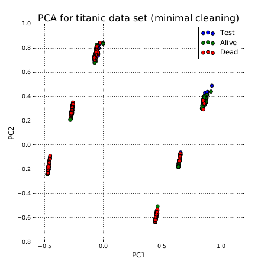

# Projects

## Classify Titanic

This project is really just an excuse to implement various machine learning algorithms from scratch in python. A training and test data set consistent of ticketing information for passengers on the Titanic was obtained from Kaggle to use in the project. The goal is to predict whether a passenger lived or died based on that ticketing information. 

### PCA

Principle component analysis was carried out primarily to visualize the data in conjunction with the KNN algorithm. It's interesting that the principle components lead to major 6 very clear clusters but it makes sense considering that major sources of variation in the data set are binary or binary like values (sex : male/female, class : 1/2/3). Based on this, it seems like KNN is not going to generate very good predicitions.

### KNN

K nearest neighbor was used to predict survival. Missing data was replace with the mean of the column and columns were normalized between 0:1. For each test point, the three nearest neightbors were calculated using euclidian distance. The prediction was simply the biggest vote of the three nearest neighbors. As we predicted earlier based on looking at the PCA, the KNN finishes pretty badly with a 71% classification success rate.

### Decision Tree

Next up is the decision tree. The algorithm recursively splits the data based on the feature and feature threshold that maximizes 'information gain' for any given node in the tree. If the information gain isn't above a given threshold (in this case 0.05) then the node becomes a leaf and the prediction of the leaf is a vote of the training data grouped at the leaf. The function does a bit better than KNN, coming in with 78% classification success rate. With some tweaking it could probably get up to the mid 80% range, but that's not the focus of this project!

